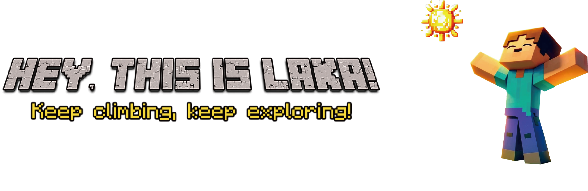
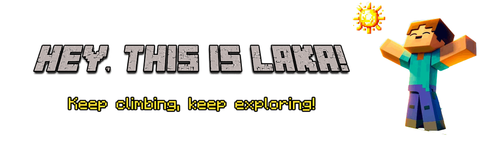








<!-- Top hero — small avatar + name (replaces removed sidebar identity) -->

  
  <h1 class="hero-name">Shaocheng Yan (颜绍程)</h1>

<!-- 

        

 -->

    <!-- <a href="https://github.com/Laka-3DV"> -->
      <!--  -->
      
    <!-- </a> -->

<!-- 

    

 -->

## 🧑‍💻 About Me

Hi, I'm **Shaocheng Yan** — a **Ph.D. student** at **Wuhan University** (M.S. 2023–25 → Ph.D. 2025–), supervised by Prof. [Jiayuan Li](https://ljy-rs.github.io/web/).
My research follows a single question, asked in two steps: given observations, **can we reconstruct the world?** — and now, **can we predict it?** From **3D reconstruction** to **world models**, the sensors stay the same; what changes is the ambition.

Outside the lab, you'll find me on a **bicycle** 🚴‍♂️ — chasing wind, sunrises 🌅, and sunsets 🌄, wherever the road takes me. When two wheels aren't enough, I head into the **mountains** 🏔️ for a good hike 🥾 — no deep thoughts, just legs, trails, and altitude.

Always open to collaboration — happy to chat research, side projects, or trail recommendations.

<strong>Focus:</strong> 3D Reconstruction · World Models · Robust Geometry · Visual Localization

  <a class="quick-link" href="https://scholar.google.com/citations?user=2h_BHmoAAAAJ" target="_blank" rel="noopener">📖 Scholar</a>
  <a class="quick-link" href="https://github.com/Laka-3DV" target="_blank" rel="noopener">💻 GitHub</a>
  <a class="quick-link" href="mailto:shaochengyan@whu.edu.cn" title="Click to copy" onclick="event.preventDefault(); navigator.clipboard.writeText('shaochengyan@whu.edu.cn').then(()=>{const o=this.innerHTML;this.innerHTML='✓ Copied';setTimeout(()=>this.innerHTML=o,1500);});">📧 Email</a>

## 🔥 News

<!-- <ul style="list-style: disc; padding-left: 20px; line-height: 1.5; font-size: 15px;"> -->
<ul style="list-style: disc; padding-left: 30px;">
  <li>
    <strong>2026.04</strong>: 🌟 Our paper <a class="paper-link" href="#ulf-loc">ULF-Loc</a> is selected as a 
    <a class="venue-label highlight" href="https://cvpr.thecvf.com/Conferences/2026" target="_blank" rel="noopener">CVPR'26 ★ Highlight</a>
    Top ~3%
  </li>
  <li>
    <strong>2026.04</strong>: 🎉 Our paper <a class="paper-link" href="#ulf-loc">ULF-Loc</a> is accepted by 
    <a class="venue-label" href="https://cvpr.thecvf.com/Conferences/2026" target="_blank" rel="noopener">CVPR'26</a>
    CCF A
  </li>
  <li>
    <strong>2025.08</strong>: 🎙 Invited by <strong>
      <a href="https://space.bilibili.com/483478083" target="_blank" title="3DCVer Bilibili Space">3DCVer</a>
    </strong> to share <a class="paper-link" href="#turboreg">TurboReg</a>!
    Replay on 
    
  </li>
  <li>
    <strong>2025.07</strong>: 🎙 Invited by <strong> 
      <a href="https://space.bilibili.com/45189691" target="_blank" title="3DCVer Bilibili Space">CVlife</a>
    </strong> to share <a class="paper-link" href="#turboreg">TurboReg</a>!
    Replay on 
    
  </li>
  <li>
    <strong>2025.06</strong>: 🎉 Our paper <a class="paper-link" href="#turboreg">TurboReg</a> is accepted by 
    <a class="venue-label" href="https://iccv.thecvf.com/Conferences/2025" target="_blank" rel="noopener">ICCV'25</a>
    CCF A
  </li>
  <li>
    <strong>2025.02</strong>: 🎉 Our paper <a class="paper-link" href="#hemora">HeMoRa</a> (zh: 赫默拉) is accepted by 
    <a class="venue-label" href="https://cvpr.thecvf.com/Conferences/2025" target="_blank" rel="noopener">CVPR'25</a>
    CCF A
  </li>
  <li>
    <strong>2024.07</strong>: 🎉 Our paper <a class="paper-link" href="#ml-semreg">ML-SemReg</a> is accepted by 
    <a class="venue-label" href="https://eccv2024.ecva.net/Conferences/2024" target="_blank" rel="noopener">ECCV'24</a>
    CCF B
  </li>
</ul>

  
Show More

  <ul style="list-style: disc; padding-left: 11.5px;">
    <li>
      <strong>2024.07</strong>: 🎉 My homepage is created!
    </li>
  </ul>

<!-- - *2025.07*: 🎉 Invited by **CVlife** to share **TurboReg**! Replay on <a href="https://www.bilibili.com/video/BV1atbSzJEdv?t=158.1" style="background: linear-gradient(90deg, #007bff, #00cc99, #9933ff); -webkit-background-clip: text; background-clip: text; -webkit-text-fill-color: transparent; font-weight: bold;">Bilibili</a>.
- *2025.06*:  🎉 Our paper **TurboReg** is accepted by **<a href="https://iccv.thecvf.com/" style="background: linear-gradient(90deg, #007bff, #00cc99, #9933ff); -webkit-background-clip: text; background-clip: text; -webkit-text-fill-color: transparent; font-weight: bold;">ICCV 2025</a>**!
- *2025.02*:  🎉 Our paper **HeMoRa** (zh: 赫默拉) is accepted by **<a href="https://cvpr.thecvf.com/Conferences/2025" style="background: linear-gradient(90deg, #007bff, #00cc99, #9933ff); -webkit-background-clip: text; background-clip: text; -webkit-text-fill-color: transparent; font-weight: bold;">CVPR 2025</a>**!
- *2024.11*:  🎉 One paper is accepted by **RA-L 2024**!
- *2024.09*:  🎉 One paper is accepted by TGRS 2024!
- *2024.07*:  🎉 One paper is accepted by **<a href="https://eccv2024.ecva.net/" style="background: linear-gradient(90deg, #007bff, #00cc99, #9933ff); -webkit-background-clip: text; background-clip: text; -webkit-text-fill-color: transparent; font-weight: bold;">ECCV 2024</a>**!
- *2024.07*:  🎉 My homepage is created!
 -->

<!-- Unified card system (shared by .pub-card / .proj-card) -->

<!--
  Per-paper citation count (infra in _includes/fetch_google_scholar_stats.html):
  Find each paper's ID in google-scholar-stats/gs_data.json, then drop
    
  inside the pub-badges row. It auto-renders as "| Citations: N".
-->

## 📚 Selected Publications

  <!-- ULF-Loc -->
  
  

    

      
ULF-Loc: Unbiased Landmark Feature for Robust Visual Localization with 3D Gaussian Splatting

      

        CVPR'26 ★ Highlight
        Top ~3%
        CCF A
      

      

        
        
        
      

      

        <a href="https://github.com/Cyril-gyd" target="_blank" rel="noopener">Yingdong Gu</a>*,
        <b>Shaocheng Yan</b>*,
        <a href="https://ericzzj1989.github.io/" target="_blank" rel="noopener">Zhenjun Zhao</a>,
        Yuan Kou, Jianxin Luo,
        <a href="https://orcid.org/0000-0003-2504-9890" target="_blank" rel="noopener">Pengcheng Shi</a>,
        <a href="https://ljy-rs.github.io/web/" target="_blank" rel="noopener">Jiayuan Li</a>
      

      
* Equal contribution (co-first authors)

      
<strong>TL;DR:</strong> Unbiased landmark features via keypoint-consensus sampling and geometry-weighted feature fusion, fundamentally solving alpha-blending bias for highly accurate and ultra-efficient visual localization with 3D Gaussian Splatting.

    

  

  <!-- TurboReg -->
  
  

    

      
TurboReg: TurboClique for Robust and Efficient Point Cloud Registration

      

        ICCV'25
        CCF A
      

      

        
        
        
        
        
      

      

        <b>Shaocheng Yan</b>,
        <a href="https://orcid.org/0000-0003-2504-9890" target="_blank" rel="noopener">Pengcheng Shi</a>,
        <a href="https://ericzzj1989.github.io/" target="_blank" rel="noopener">Zhenjun Zhao</a>,
        Kaixin Wang, Kuang Cao, Ji Wu,
        <a href="https://ljy-rs.github.io/web/" target="_blank" rel="noopener">Jiayuan Li</a>
      

      
<strong>TL;DR:</strong> A highly efficient and robust estimator for point cloud registration (PCR), supporting both CPU and GPU platforms.

    

  

  <!-- HeMoRa -->
  
  

    

      
HeMoRa: Unsupervised Heuristic Consensus Sampling for Robust Point Cloud Registration

      

        CVPR'25
        CCF A
      

      

        
        
        
      

      

        <b>Shaocheng Yan</b>,
        <a href="https://yimingwangmingle.github.io/bio/" target="_blank" rel="noopener">Yiming Wang</a>,
        <a href="https://kaiyanzhaophoenix.github.io/bio/" target="_blank" rel="noopener">Kaiyan Zhao</a>,
        <a href="https://orcid.org/0000-0003-2504-9890" target="_blank" rel="noopener">Pengcheng Shi</a>,
        <a href="https://ericzzj1989.github.io/" target="_blank" rel="noopener">Zhenjun Zhao</a>,
        <a href="https://skyearth.org/zhangyj/" target="_blank" rel="noopener">Yongjun Zhang</a>,
        <a href="https://ljy-rs.github.io/web/" target="_blank" rel="noopener">Jiayuan Li</a>
      

      
<strong>TL;DR:</strong> Learning a sampling probability distribution for matches in robust estimation — no supervision, reinforcement-inspired.

    

  

  <!-- ML-SemReg -->
  
  

    

      
ML-SemReg: Boosting Point Cloud Registration with Multi-level Semantic Consistency

      

        ECCV'24
        CCF B
      

      

        
        
        
      

      

        <b>Shaocheng Yan</b>,
        <a href="https://orcid.org/0000-0003-2504-9890" target="_blank" rel="noopener">Pengcheng Shi</a>,
        <a href="https://ljy-rs.github.io/web/" target="_blank" rel="noopener">Jiayuan Li</a>
      

      
<strong>TL;DR:</strong> Boosting 3D keypoint match recall using semantic labels — no learning needed, SLAM-ready.

    

  

For the full list of publications (including co-authored work), see <a href="https://scholar.google.com/citations?user=2h_BHmoAAAAJ" target="_blank" rel="noopener">Google Scholar →</a>

## 💻 Selected Projects

  

    

      

        <a class="proj-title" href="https://github.com/Laka-3DV/TurboReg" target="_blank" rel="noopener">TurboReg</a>
        <a class="github-button" href="https://github.com/Laka-3DV/TurboReg" data-icon="octicon-star" data-show-count="true" aria-label="Star Laka-3DV/TurboReg on GitHub">Star</a>
      

      
ICCV'25

      
TurboClique-based robust & efficient point cloud registration (CPU/GPU).

    

  

  

    

      

        <a class="proj-title" href="https://github.com/Cyril-gyd/ULF-Loc" target="_blank" rel="noopener">ULF-Loc</a>
        <a class="github-button" href="https://github.com/Cyril-gyd/ULF-Loc" data-icon="octicon-star" data-show-count="true" aria-label="Star Cyril-gyd/ULF-Loc on GitHub">Star</a>
      

      
CVPR'26 ★ Highlight

      
Unbiased landmark features for visual localization with 3D Gaussian Splatting.

    

  

  

    

      

        <a class="proj-title" href="https://github.com/Laka-3DV/ML-SemReg" target="_blank" rel="noopener">ML-SemReg</a>
        <a class="github-button" href="https://github.com/Laka-3DV/ML-SemReg" data-icon="octicon-star" data-show-count="true" aria-label="Star Laka-3DV/ML-SemReg on GitHub">Star</a>
      

      
ECCV'24

      
Multi-level semantic consistency for boosting registration recall.

    

  

 

## 🎙 Invited Talks & Sharing

  

    

      2025.08
      
    

    

      Invited talk on <a class="paper-link" href="#turboreg">TurboReg</a> @ <a href="https://space.bilibili.com/483478083" target="_blank" rel="noopener">3DCVer</a>
    

  

  

    

      2025.07
      
    

    

      Invited talk on <a class="paper-link" href="#turboreg">TurboReg</a> @ <a href="https://space.bilibili.com/45189691" target="_blank" rel="noopener">CVlife</a>
    

  

## 🏆 Honors and Awards

- *2025.04*, **Outstanding Graduate**, Class of 2025  
- *2024.11*, **National Second Prize**, China Graduate Mathematical Modeling Contest
- *2022.08*, **National First Prize (Champion)**, China University Robotics Innovation Competition  
- *2020.12*, **First Prize**, 11th National College Student Mathematics Competition (Non-Math Major Category)

## 🎓 Educations
- *2025.09 - Present*, Ph.D. in Photogrammetry and Remote Sensing, School of Remote Sensing and Information Engineering, Wuhan University
- *2023.09 - 2025.06*, M.S. in Geomatics Engineering, School of Remote Sensing and Information Engineering, Wuhan University
- *2019.09 - 2023.06*, B.S. in Electronic and Information Engineering, School of Electrical Engineering, Southwest Jiaotong University